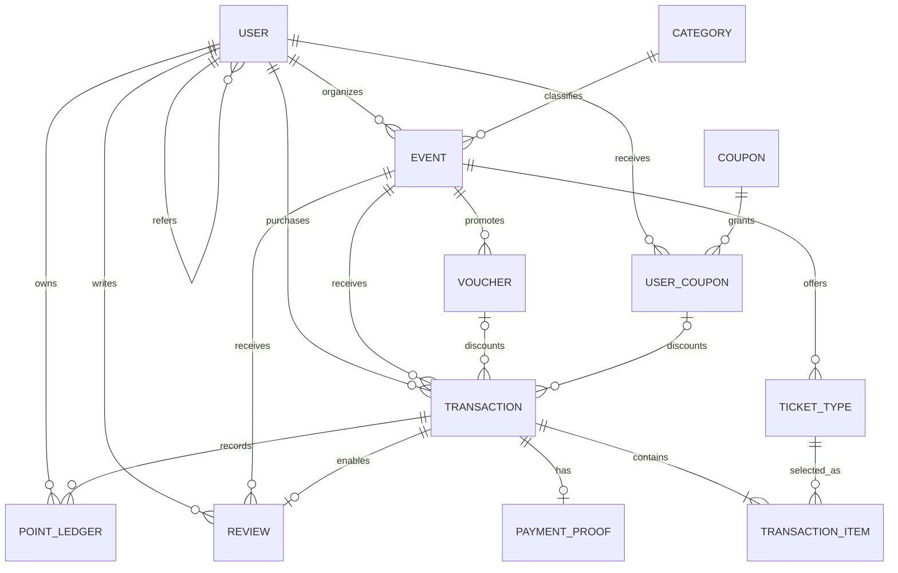

# Eventure

Eventure is a responsive event management platform for discovering, publishing, purchasing, and managing events across Indonesia. This repository is a two-person mini project built from one shared architecture so Feature 1 and Feature 2 can be developed independently and merged safely.

## Current status

Feature 1 and Feature 2 are integrated on `develop`. The complete customer flow now covers discovery, checkout, payment-proof upload, automatic deadlines, order tracking, and attended-event reviews. The organizer flow covers authentication, event/ticket/voucher management, proof decisions, attendee lists, analytics, profile management, and email notifications.

## Main features

- Event discovery with debounced search, backend filtering, sorting, and pagination
- Event details, ticket types, organizer event CRUD, and event-specific vouchers
- Six-state ticket transaction flow with payment proof deadlines and rollback rules
- Post-attendance event reviews and organizer ratings
- JWT authentication, customer/organizer authorization, and protected pages
- Referral codes, expiring points, referral coupons, and profile management
- Organizer dashboard with transaction review, attendee lists, reports, and charts
- Cloud file uploads and asynchronous HTML email notifications

## Tech stack

| Layer                | Technology                                           |
| -------------------- | ---------------------------------------------------- |
| Web                  | Next.js 16, React 19, TypeScript                     |
| API                  | Node.js, Express 5, TypeScript                       |
| Data                 | PostgreSQL 16, Prisma ORM 6                          |
| Quality              | ESLint, Prettier, Vitest, Testing Library, Supertest |
| Local infrastructure | Docker Compose, pnpm workspaces                      |
| Deployment target    | Vercel (web and API), Supabase PostgreSQL            |

Recharts supplies organizer analytics, Multer and Cloudinary handle image uploads, and Nodemailer sends non-blocking account and transaction emails.

## API surface

- Public: `GET /api/v1/events`, `/events/categories`, `/events/:slug`, and `/events/:slug/reviews`
- Authentication and accounts: `/api/v1/auth` and authenticated profile/reward routes under `/api/v1/users/me`
- Organizer: event CRUD under `/api/v1/organizer/events`, with nested `/tickets` and `/vouchers`
- Organizer operations: proof decisions under `/api/v1/organizer/transactions` and reporting under `/api/v1/dashboard`
- Customer: checkout/history under `/api/v1/transactions`, proof upload under `/:id/payment-proof`, cancellation under `/:id/cancel`, and reviews under `/:id/review`

See the [Feature 1 Development Log](docs/FEATURE_1_DEVELOPMENT_LOG.md) and [Integration Development Log](docs/INTEGRATION_DEVELOPMENT_LOG.md) for the commit-by-commit record.
See the [Vercel and Supabase Deployment Guide](docs/DEPLOYMENT.md) for the hosted architecture, environment-variable contract, migration procedure, and production checklist.

## Repository layout

```text
apps/
  api/                 Express REST API
  web/                 Next.js application
packages/
  database/            Prisma schema, client, and seed
  shared/              Cross-app API and domain contracts
docs/                   Architecture and collaboration guides
```

## Prerequisites

- Node.js 22.14 or newer
- pnpm 11.9 or newer
- Docker Desktop, or another PostgreSQL 16 instance
- Git

## Local setup

1. Clone the repository and switch to the integration branch.

   ```bash
   git clone https://github.com/htandiono/mini-project-event-management-platform.git
   cd mini-project-event-management-platform
   git switch develop
   ```

2. Create the local environment file.

   PowerShell:

   ```powershell
   Copy-Item .env.example .env
   ```

   macOS/Linux:

   ```bash
   cp .env.example .env
   ```

3. Replace the placeholder JWT, Cloudinary, and SMTP values in `.env`. Never commit `.env`.

4. Install dependencies and start PostgreSQL.

   ```bash
   pnpm install
   docker compose up -d
   ```

5. Generate the Prisma client, apply the committed migrations, and seed demo data.

   ```bash
   pnpm db:generate
   pnpm db:migrate:deploy
   pnpm db:seed
   ```

6. Start both applications.

   ```bash
   pnpm dev
   ```

   - Web: `http://localhost:3000`
   - API health: `http://localhost:4000/api/v1/health`

## Development commands

| Command                  | Purpose                                                 |
| ------------------------ | ------------------------------------------------------- |
| `pnpm dev`               | Run web and API development servers                     |
| `pnpm build`             | Build all packages and applications in dependency order |
| `pnpm lint`              | Lint every workspace                                    |
| `pnpm typecheck`         | Run strict TypeScript checks                            |
| `pnpm test`              | Run unit and integration tests                          |
| `pnpm verify`            | Run all checks required before a pull request           |
| `pnpm db:migrate:deploy` | Apply committed migrations without creating a new one   |
| `pnpm db:seed`           | Upsert Indonesian demo events, accounts, and orders     |
| `pnpm db:studio`         | Open Prisma Studio                                      |
| `pnpm db:validate`       | Validate the shared Prisma schema                       |

## Database ERD

Money is stored as whole Indonesian rupiah in integer columns; timestamps are stored in UTC and displayed in `Asia/Jakarta` at the UI boundary.



The full source of truth is [`packages/database/prisma/schema.prisma`](packages/database/prisma/schema.prisma).

## Demo accounts

Local seed values come from `.env`; the example defaults are:

| Role      | Email                      | Password        |
| --------- | -------------------------- | --------------- |
| Customer  | `customer@eventure.local`  | `Customer123!`  |
| Organizer | `organizer@eventure.local` | `Organizer123!` |
| Customer  | `customer2@example.com`    | `Password123!`  |
| Organizer | `oscar@example.com`        | `Password123!`  |

Hosted reviewer values are managed through Vercel's `DEMO_*` variables and should be shared privately; the values above are local seed examples.

## Git workflow

- `main` contains production-ready code only.
- `develop` is the integration branch.
- `feature/feature-1-events-transactions` belongs to Feature 1.
- `feature/feature-2-accounts-dashboard` belongs to Feature 2.
- Feature work is merged into `develop`; production promotion uses a reviewed pull request from `develop` to `main`.
- Use conventional, single-purpose commits such as `feat(api): add paginated event query`.
- Run `pnpm verify` before every pull request.

See [Collaboration Guide](docs/COLLABORATION.md) for ownership and merge rules, and [Partner AI Handoff](docs/PARTNER_AI_HANDOFF.md) for a copy-ready implementation brief.

## Deployment URLs

| Service     | Production URL                                                  |
| ----------- | --------------------------------------------------------------- |
| Frontend    | `https://mini-project-event-management-platf-eta.vercel.app`    |
| Backend API | `https://mini-project-event-management-platf.vercel.app/api/v1` |

Both projects deploy from `main`; pull requests receive Vercel previews. The Supabase production database is migrated and seeded with Indonesian events and demo accounts before production promotion.
