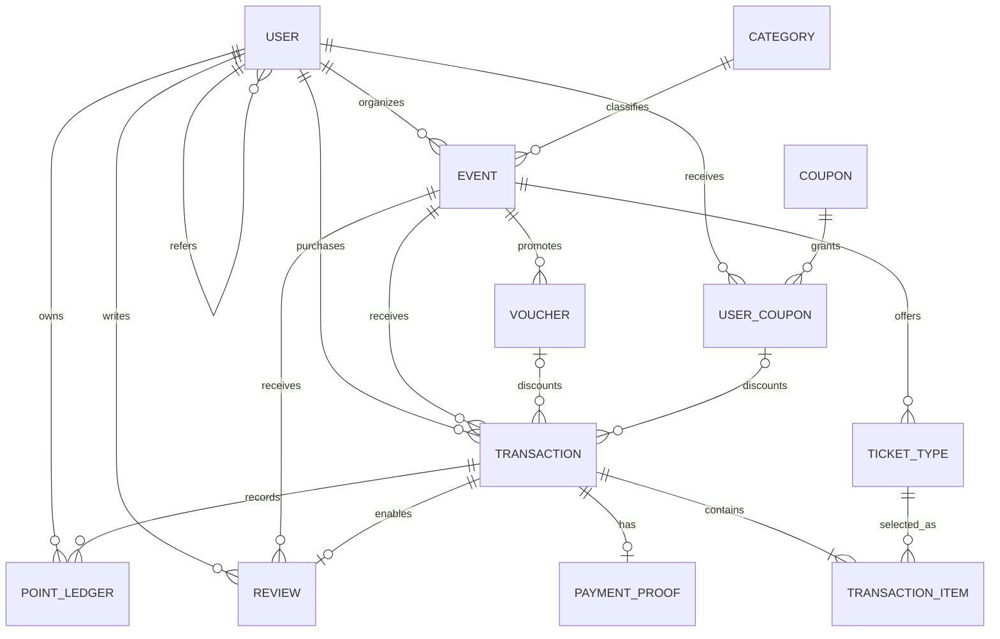

# Eventure

Eventure is a responsive event management platform for discovering, publishing, purchasing, and managing events across Indonesia. This repository is a two-person mini project built from one shared architecture so Feature 1 and Feature 2 can be developed independently and merged safely.

## Current status

The shared foundation is ready: monorepo tooling, frontend theme, Express API shell, Prisma data model, seed data, tests, CI, local PostgreSQL, and contributor contracts. Product feature endpoints and screens are intentionally left to the two feature branches.

## Main features

- Event discovery with debounced search, backend filtering, sorting, and pagination
- Event details, ticket types, organizer event CRUD, and event-specific vouchers
- Six-state ticket transaction flow with payment proof deadlines and rollback rules
- Post-attendance event reviews and organizer ratings
- JWT authentication, customer/organizer authorization, and protected pages
- Referral codes, expiring points, referral coupons, and profile management
- Organizer dashboard with transaction review, attendee lists, reports, and charts
- Cloud file uploads and asynchronous HTML email notifications

## Tech stack

| Layer                | Technology                                                        |
| -------------------- | ----------------------------------------------------------------- |
| Web                  | Next.js 16, React 19, TypeScript                                  |
| API                  | Node.js, Express 5, TypeScript                                    |
| Data                 | PostgreSQL 16, Prisma ORM 6                                       |
| Quality              | ESLint, Prettier, Vitest, Testing Library, Supertest              |
| Local infrastructure | Docker Compose, pnpm workspaces                                   |
| Deployment target    | Vercel (web), Railway/Vercel (API), Railway/Supabase (PostgreSQL) |

Planned feature integrations required by the brief are Recharts, Multer with Cloudinary, and Nodemailer. They should be added only in the feature that uses them.

## Repository layout

```text
apps/
  api/                 Express REST API
  web/                 Next.js application
packages/
  database/            Prisma schema, client, and seed
  shared/              Cross-app API and domain contracts
docs/                   Architecture and collaboration guides
```

## Prerequisites

- Node.js 22.14 or newer
- pnpm 11.9 or newer
- Docker Desktop, or another PostgreSQL 16 instance
- Git

## Local setup

1. Clone the repository and switch to your assigned branch.

   ```bash
   git clone <repository-url>
   cd "Mini Project Event Management Platform"
   git switch feature/feature-2-accounts-dashboard
   ```

2. Create the local environment file.

   PowerShell:

   ```powershell
   Copy-Item .env.example .env
   ```

   macOS/Linux:

   ```bash
   cp .env.example .env
   ```

3. Replace the placeholder JWT, Cloudinary, and SMTP values in `.env`. Never commit `.env`.

4. Install dependencies and start PostgreSQL.

   ```bash
   pnpm install
   docker compose up -d
   ```

5. Generate the Prisma client, create the first local migration, and seed demo data.

   ```bash
   pnpm db:generate
   pnpm db:migrate -- --name init
   pnpm db:seed
   ```

6. Start both applications.

   ```bash
   pnpm dev
   ```

   - Web: `http://localhost:3000`
   - API health: `http://localhost:4000/api/v1/health`

## Development commands

| Command            | Purpose                                                 |
| ------------------ | ------------------------------------------------------- |
| `pnpm dev`         | Run web and API development servers                     |
| `pnpm build`       | Build all packages and applications in dependency order |
| `pnpm lint`        | Lint every workspace                                    |
| `pnpm typecheck`   | Run strict TypeScript checks                            |
| `pnpm test`        | Run unit and integration tests                          |
| `pnpm verify`      | Run all checks required before a pull request           |
| `pnpm db:studio`   | Open Prisma Studio                                      |
| `pnpm db:validate` | Validate the shared Prisma schema                       |

## Database ERD

Money is stored as whole Indonesian rupiah in integer columns; timestamps are stored in UTC and displayed in `Asia/Jakarta` at the UI boundary.



The full source of truth is [`packages/database/prisma/schema.prisma`](packages/database/prisma/schema.prisma).

## Demo accounts

Local seed values come from `.env`; the example defaults are:

| Role      | Email                      | Password        |
| --------- | -------------------------- | --------------- |
| Customer  | `customer@eventure.local`  | `Customer123!`  |
| Organizer | `organizer@eventure.local` | `Organizer123!` |

Replace these for every hosted environment and update this table with dedicated reviewer accounts before submission.

## Git workflow

- `main` contains production-ready code only.
- `develop` is the integration branch.
- `feature/feature-1-events-transactions` belongs to Feature 1.
- `feature/feature-2-accounts-dashboard` belongs to Feature 2.
- Open pull requests into `develop`; never push feature work directly to `main`.
- Use conventional, single-purpose commits such as `feat(api): add paginated event query`.
- Run `pnpm verify` before every pull request.

See [Collaboration Guide](docs/COLLABORATION.md) for ownership and merge rules, and [Partner AI Handoff](docs/PARTNER_AI_HANDOFF.md) for a copy-ready implementation brief.

## Deployment URLs

| Service     | URL              |
| ----------- | ---------------- |
| Frontend    | Not deployed yet |
| Backend API | Not deployed yet |

Replace these placeholders before the demo. The production database must be migrated and seeded, and every demonstration flow must be retested against the deployed URLs.
