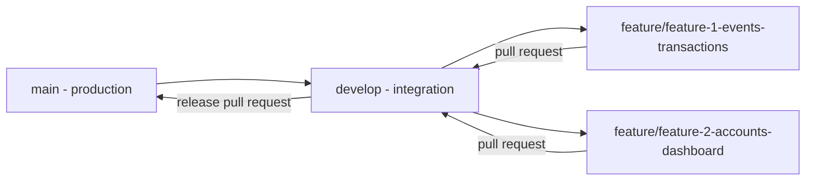

# Two-Person Collaboration Guide

The project uses one repository and one integration line. Contributors work in parallel on separate feature branches and exchange changes through pull requests into `develop`.

## Branch map



- `main`: deployable releases only; no direct pushes.
- `develop`: integration and shared-contract changes.
- `feature/feature-1-events-transactions`: event discovery/CRUD, vouchers, checkout, expiry, and reviews.
- `feature/feature-2-accounts-dashboard`: authentication/referrals/profile, organizer dashboard, proof decisions, and notification email.

Use smaller child branches from your feature branch when a pull request would otherwise contain several independent flows.

## Ownership matrix

| Capability                                   |   Feature 1   | Feature 2 |  Shared review required   |
| -------------------------------------------- | :-----------: | :-------: | :-----------------------: |
| Public landing, event search/filter/detail   |    Primary    |     -     |   Shared UI primitives    |
| Event/category/ticket/voucher CRUD           |    Primary    |     -     |     Prisma migrations     |
| Checkout and payment countdown               |    Primary    |  Support  |   Transaction contract    |
| Expiry/cancel rollback and reviews           |    Primary    |     -     |   Transaction contract    |
| Register/login/logout/RBAC                   |    Support    |  Primary  | Auth user type/middleware |
| Referral points/coupons/profile upload       |       -       |  Primary  |     Prisma migrations     |
| Organizer event/attendee dashboard           | Supplies APIs |  Primary  |      Dashboard DTOs       |
| Accept/reject payment proofs and email       |    Support    |  Primary  | Status transition service |
| Design tokens, shared types, CI, base schema |       -       |     -     |           Both            |

“Support” means the primary owner may need an endpoint, service call, or UI entry point from the other workstream. Agree on the shared type or route first; then each person can implement their side independently.

## Daily integration routine

1. Start from your assigned branch and pull its remote updates.
2. Fetch `develop`, then rebase or merge it before starting a database migration or shared-contract change.
3. Make one user-observable or infrastructure purpose per commit.
4. Run focused tests while working and `pnpm verify` before a pull request.
5. Open a pull request into `develop` and complete the template.
6. The other contributor reviews changes to Prisma, shared types, global CSS, auth middleware, and transaction state logic.
7. Squash only noisy fixup commits. Preserve already-meaningful atomic commits.

## Commit standard

Use Conventional Commit-style messages:

```text
feat(web): add debounced event search input
feat(api): paginate organizer transactions
fix(api): restore seats when payment expires
test(api): cover referral point expiration
docs: record voucher ownership contract
chore(database): add event search indexes
```

A meaningful commit changes one coherent concern, leaves the repository in a valid state, and explains an outcome. Formatting-only churn, generated build output, and repeated “WIP” snapshots do not count toward the assignment's 20-commit requirement.

## Shared contract procedure

Before changing `schema.prisma`, `packages/shared`, global theme tokens, API error shape, or transaction statuses:

1. Open a small issue describing the contract change.
2. Get acknowledgement from the other contributor.
3. Make the contract change in a focused branch from `develop`.
4. Include migration and contract tests where relevant.
5. Merge that pull request first; both feature branches then update from `develop`.

This keeps feature pull requests from carrying incompatible versions of the same contract.

## Merge conflict hotspots

- `packages/database/prisma/schema.prisma`: place new models near their domain and avoid reformatting unrelated models.
- `apps/web/src/app/globals.css`: prefer component-level styles or append a named section without reorganizing existing rules.
- `packages/shared/src/index.ts`: one export per line keeps conflicts easy to resolve.
- Router index files: add one route registration without reordering the file.
- `.env.example`: append variables under the matching service heading and document them in the pull request.

## Definition of done for a flow

- Backend validation and authorization are enforced, not only hidden in the UI.
- Expected, invalid, empty, and boundary paths are tested.
- Multi-record writes use a SQL transaction with rollback.
- API responses use the shared success/error envelope.
- UI covers loading, empty, error, and success states responsively.
- Confirmation appears before modifying or destructive actions.
- No credentials, hardcoded production URLs, `console.log`, or local uploads are committed.
- Documentation and seed data remain accurate.
