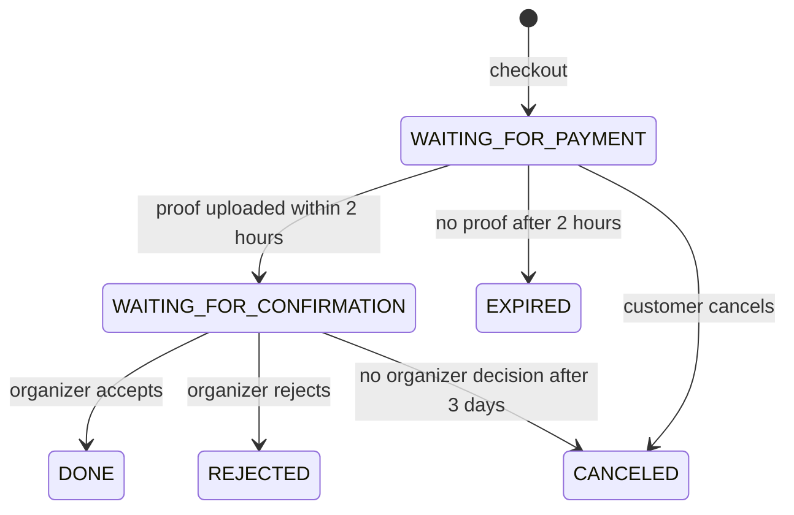

# Database and API Contract Guide

The Prisma schema in `packages/database/prisma/schema.prisma` is the single source of truth. Both features share it, so schema edits are treated as integration changes rather than private branch details.

## Connection setup

1. Copy `.env.example` to `.env` at the repository root.
2. Start PostgreSQL with `docker compose up -d`.
3. Run `pnpm db:generate`.
4. Run `pnpm db:migrate -- --name <short-description>` after a schema change.
5. Run `pnpm db:seed` for deterministic demo users and baseline event data.

The root scripts load `.env` and forward it to Prisma and both applications. Never create or commit an environment file inside a workspace package.

For a hosted database, replace only `DATABASE_URL`. Keep pooled and direct URLs separate if the selected provider requires them, and follow that provider's Prisma deployment instructions.

## Domain ownership

| Area                                | Primary owner | Models                                                 |
| ----------------------------------- | ------------- | ------------------------------------------------------ |
| Accounts and referrals              | Feature 2     | `User`, `PointLedger`, `Coupon`, `UserCoupon`          |
| Events and promotion                | Feature 1     | `Category`, `Event`, `TicketType`, `Voucher`, `Review` |
| Ticket checkout                     | Feature 1     | `Transaction`, `TransactionItem`                       |
| Organizer decision and proof review | Feature 2     | `Transaction`, `PaymentProof`                          |

`Transaction` is a deliberate shared boundary. Feature 1 creates transactions and implements payment/expiry rollback. Feature 2 accepts or rejects proofs and supplies organizer reporting. Contract changes to either shared model require a small coordination pull request before feature code depends on them.

## Data rules

- Store IDR as whole rupiah in `Int` fields. Never use floating-point values for money.
- Store timestamps in UTC. Convert to Jakarta time only for display and user input boundaries.
- Query main entities with `deletedAt: null`; deletion sets `deletedAt` rather than removing the record.
- Use CUID identifiers internally and human-readable unique slugs/invoice numbers externally.
- Validate request input with Zod before calling a service.
- Do not return `passwordHash`, reset tokens, cloud public IDs, or internal secrets from the API.
- Search, filter, sort, and paginate in PostgreSQL through Prisma. Do not paginate an already-fetched frontend array.

## Required transaction boundaries

Use `prisma.$transaction` whenever one action changes multiple records. The following flows must be atomic:

- Register with a referral: create user, issue coupon, and credit the referrer's expiring points.
- Checkout: validate capacity, decrement seats, reserve ticket items, debit points, and redeem discounts.
- Expire/cancel/reject: transition status, restore seats, restore points, and restore coupon/voucher usage.
- Accept payment: validate the allowed status transition, mark the transaction done, and trigger email after the database transaction commits.

External email or cloud calls do not belong inside a long-running database transaction. Persist the state first, commit, then enqueue or dispatch the asynchronous side effect with retry/error handling.

## Transaction state machine



No endpoint may skip this state machine. A status update and its compensating changes occur in the same SQL transaction.

## Migration rules

- One schema purpose per migration; use descriptive names such as `add_referral_rewards`.
- Commit both `schema.prisma` and the generated migration directory.
- Never edit a migration that another contributor has already pulled; add a new migration.
- Rebase or merge the latest `develop` before producing a migration to avoid divergent histories.
- Update the README ERD and this guide when relationships change.
- Seed code must be idempotent so repeated `pnpm db:seed` runs are safe.

## API response contract

Success:

```json
{
  "success": true,
  "message": "Events retrieved",
  "data": {}
}
```

Failure:

```json
{
  "success": false,
  "message": "Validation failed",
  "errors": [{ "field": "email", "message": "Invalid email" }]
}
```

Paginated endpoints return `{ data, total, page, totalPages, limit }` inside the success response's `data` property. Shared types live in `packages/shared`; update them before separately implementing frontend and backend consumers.
